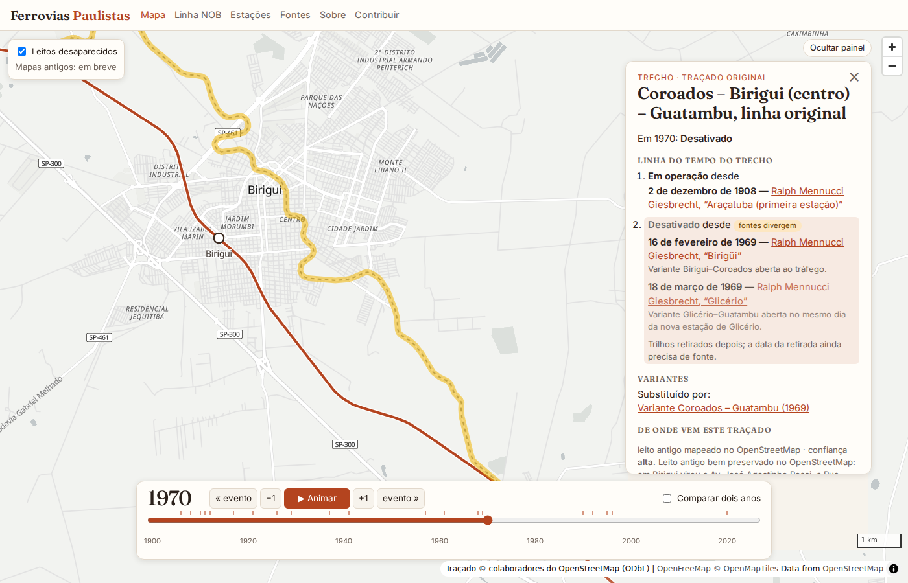

# Ferrovias do Brasil

**Mapa interativo e linha do tempo das ferrovias do Brasil.** Arraste o ano e veja os
trilhos avançarem sertão adentro, as variantes mudarem o traçado e os leitos antigos virarem
avenidas, estradas ou fundo de represa. Cada data no mapa aponta para uma fonte.

O objetivo é um mapa completo da malha ferroviária brasileira. Linhas já pesquisadas:

- **Estrada de Ferro Noroeste do Brasil**, de Bauru ao rio Paraná (1906 → hoje), com o piloto em **Birigui**;
- **São Paulo Railway**, de Santos a Jundiaí (1867), com os dois sistemas de cabos da Serra do Mar
  (1867 e 1901) e a cremalheira de 1974;
- **Companhia Mogiana**, de Campinas a Ribeirão Preto (1875–1883), com as variantes que tiraram os
  trilhos dos centros das cidades entre 1929 e 1979;
- **Estrada de Ferro Sorocabana**, de São Paulo a Botucatu (1875–1889) e o Ramal de Bauru (1897–1905),
  com a linha dupla de 1928 e a Variante Juquiratiba–Botucatu (1952), que aposentou a subida da serra
  por Vitoriana;
- **Companhia Paulista**, de Jundiaí a Bauru (1872–1910): a Linha Tronco até Rio Claro, com datas
  tiradas dos relatórios da própria companhia, e o caminho até Bauru pelas antigas linhas da
  Companhia Rio-Clarense, onde a Paulista encontra a Noroeste.

O resto da malha paulista aparece como contexto, à espera de pesquisa.



## O que já dá para ver

- **A linha crescendo:** Bauru (1906) → Avanhandava (1908) → Araçatuba (2/12/1908) → Itapura e
  Jupiá, no rio Paraná (1910). O botão *Animar* percorre os anos.
- **Os dois caminhos para o Paraná:** a linha original pelo vale do Tietê, abandonada pela malária,
  e a **Variante de Jupiá** pelo espigão (1929–1937). A linha velha virou o Ramal de Lussanvira
  (1941–1961) e hoje está debaixo das represas.
- **Birigui:** a linha atravessava o centro até a **Variante Coroados–Guatambu (1969)**. O leito
  antigo é hoje a Av. José Agostinho Rossi, a Rua Fernando Castilho, a Rua José Pacitti e uma vicinal.
- **Araçatuba:** a linha saiu do centro em 1992.
- **Mapa de 1912 por baixo:** o *Mappa da viação ferrea de São Paulo* (R. Heyse, Princeton) aparece
  georreferenciado entre 1905 e 1930, e a linha original do vale do Tietê foi redesenhada sobre ele.
- **Variantes de 1962–1971:** Lins, Cafelândia, Promissão e Glicério, com as estações velhas e novas.
- **Toda a malha paulista:** cerca de 8.000 km de ferrovias do OpenStreetMap (em uso, desativadas e
  leitos antigos) aparecem em violeta como contexto, até cada linha ganhar sua história pesquisada.
- **Modo comparar:** dois anos lado a lado; em verde o que surgiu, em vermelho o que sumiu.
- **Fontes que divergem** aparecem lado a lado, com aviso.

## Como funciona

```
src/content/
  network/nob/network.yaml   ← trechos e nós da linha, com o histórico de status de cada trecho (curado)
  network/nob/geometry.geojson ← geometria de cada trecho (gerada do OpenStreetMap)
  stations/  cities/  events/  sources/  companies/  lines/  historic-maps/
scripts/
  import-osm.ts         ← Overpass → menor caminho em grafo ferroviário → geometria dos trechos
  validate.ts           ← schemas + referências cruzadas
  validate-network.ts   ← topologia + comparação com quilometragens históricas
  import-malha.ts       ← toda a malha do estado (OSM) → public/data/malha-sp.geojson
  build-georef.ts       ← anotação IIIF de georreferenciamento (malha do mapa + pontos de controle)
  apply-traces.ts       ← linhas traçadas sobre mapas antigos → geometria dos trechos
src/lib/                ← datas parciais, afirmações com fonte, rede versionada
src/components/map/     ← MapLibre + linha do tempo + painel (Svelte)
```

- **Astro** gera um site estático. O mapa é uma ilha **Svelte** com **MapLibre GL**, sobre a base
  OpenFreeMap, sem chave de API.
- O traçado é uma **rede de trechos versionados**. Cada trecho tem um `status_history` (em operação,
  só carga, desativado, trilhos retirados, submerso). Uma variante cria um trecho novo que
  `replaces` o antigo, e as duas geometrias ficam guardadas.
- A geometria é o **menor caminho** sobre as vias do OpenStreetMap: a via atual ou os leitos
  abandonados e erradicados, que os mapeadores do OSM registraram com cuidado. Pequenas lacunas são
  fechadas e contabilizadas. Onde o leito sumiu, o traçado é esquemático e marcado com confiança baixa.
- Datas são **afirmações com fonte** (`claims`). Quando as fontes divergem, as duas ficam.
- A camada de **mapas antigos** usa o **Allmaps** (IIIF) e liga sozinha quando um mapa ganha uma
  anotação de georreferenciamento.

## Rodando

Requisitos: Node.js 22+.

```bash
npm install
npm run dev               # http://localhost:4321
npm run validate          # schemas e referências
npm run validate-network  # traçado e quilometragens
npm test
npm run build             # site estático em dist/
```

## Contribuir

Historiadores, ferromodelistas, moradores das cidades da linha e programadores são bem-vindos.
Veja [CONTRIBUTING.md](CONTRIBUTING.md) e a agenda de pesquisa em
[research/pendencias.md](research/pendencias.md). Ela lista estações perdidas, variantes por mapear
e datas sem fonte primária.

## Licenças

- Código: [MIT](LICENSE)
- Textos e dados históricos: [CC BY-SA 4.0](LICENSE-CONTENT.md)
- Geometria do traçado, derivada do OpenStreetMap: [ODbL 1.0](LICENSE-DATA.md),
  © colaboradores do OpenStreetMap

---

*English summary:* an open-source interactive map and timeline of Brazil's railways, starting
with the Noroeste do Brasil line in São Paulo state. The track network is modelled as versioned segments with sourced status histories;
geometry is derived from OpenStreetMap (including abandoned and razed railway beds) by shortest-path
routing. Built with Astro, Svelte, MapLibre GL and Allmaps.
